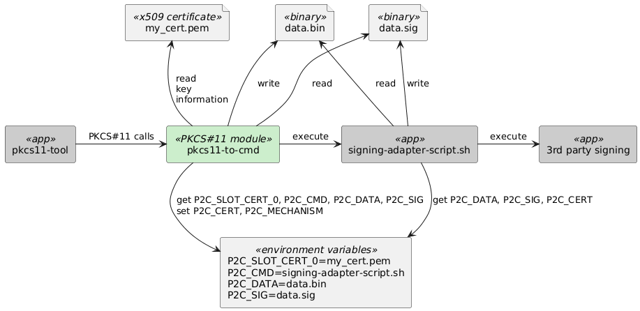

<!--
SPDX-FileCopyrightText: (C) 2025 Siemens
SPDX-License-Identifier: MIT

Authors:
  Eugen Kremer <eugen.kremer@siemens.com>
-->
# PKCS11-TO-CMD - Externalize PKCS#11 operations to a CLI


The `pkcs11-to-cmd` is a `PKCS#11` module which allows [PKCS#11](https://docs.oasis-open.org/pkcs11/pkcs11-base/v3.0/pkcs11-base-v3.0.html) operations to be performed via command line tools. This is useful for environments where other tools expect signing operations through PKCS#11 modules but your actual infrastructure does not have a corresponding PKCS#11 module but a CLI interface. The `pkcs11-to-cmd` acts as a bridge, translating PKCS#11 calls into shell commands that interact with a given `command line application`. In order to achive the goal `pkcs11-to-cmd` tries to retrieve missing information about the used key from provided `x509` certificate.



In the diagram above the `pkcs11-tool` (from the [OpenSC](https://github.com/OpenSC/OpenSC/wiki) package) is the actual tool, but stays there as a representee of any tool which is capable to interact with a PKCS#11 modules.

## How to use

### Parameters

The parameters used by `pkcs11-to-cmd` are passed as environment variables. The following parameters are supported:

* `P2C_CMD` - The command to be executed for signing operations.
* `P2C_DATA` - The path to the data to be signed. `pkcs11-to-cmd` will store passed data in this file.
* `P2C_SIG` - The path to the signature file. `pkcs11-to-cmd` expects the generated signature in this file.
* `P2C_SLOT_CERT_<0-9>` - The path to the x509 certificate file. This file is used to extract the public key and other information needed for signing.
* `P2C_CERT` - The path to the x509 certificate file, selected by the pksc11-tool. The value is one from the `P2C_SLOT_CERT_<0-9>` variables. This variable is set by `pkcs11-to-cmd` and used by the signing command (`P2C_CMD`).
* `P2C_DEBUG` - If set to `1`, enables debugging output. This will print the API calls processed by `pkcs11-to-cmd` to `stderr`.
* `P2C_MECHANISM` - The mechanism to be used for signing operations. The application calling PKCS#11 API will set mechanism and `pkcs11-to-cmd` will pass it to the signing command as an environment variable. Its value is one of the PKCS#11 mechanism names, e.g. `CKM_RSA_PKCS`, `CKM_ECDSA`, etc.

### Listing available tokens

Following example shows how to list available tokens in `pkcs11-to-cmd`. The command helps you to debug the settings, when you use `pkcs11-to-cmd` first time. In this example the two slots are configured by the environment variables `P2C_SLOT_CERT_0` and `P2C_SLOT_CERT_2`. The `P2C_SLOT_CERT_1` is not configured and therefore empty in the output. The `pkcs11-tool` is used to list the available slots. The `token label` and `serial num` are derived from the number of the slot. You can use them to address initialized slots (see [Resigning with RAUC](#resigning-with-rauc)) in PKCS#11 tools.

```bash
export P2C_SLOT_CERT_0="tests/data/my_rsa_0.pem"
export P2C_SLOT_CERT_2="tests/data/my_ec_0.pem"
pkcs11-tool --module "build/libpkcs11-to-cmd.so" -L
Available slots:
Slot 0 (0x0): tests/data/my_rsa_0.pem
  token label        : pkcs11-to-cmd-0
  token manufacturer : pkcs11-to-cmd
  token model        : sw
  token flags        : token initialized
  hardware version   : 1.0
  firmware version   : 1.0
  serial num         : sn-0
  pin min/max        : 0/0
Slot 1 (0x1): 
  (empty)
Slot 2 (0x2): tests/data/my_ec_0.pem
  token label        : pkcs11-to-cmd-2
  token manufacturer : pkcs11-to-cmd
  token model        : sw
  token flags        : token initialized
  hardware version   : 1.0
  firmware version   : 1.0
  serial num         : sn-2
  pin min/max        : 0/0
```

### Resigning with RAUC

[RAUC](https://rauc.io/) is an **O**ver **T**he **A**ir update technology, client and build tool. It is used to create and manage software update bundles for embedded Linux systems. The `pkcs11-to-cmd` can be used to resign existing RAUC update bundles with a 3rd party signing tool, which is not a PKCS#11 module but a command line application. This allows to transform a development version of a RAUC bundle into a production version.

```bash
export P2C_CMD=tests/data/sign-cmd-rsautl.sh
export P2C_DATA=/tmp/data.bin
export P2C_SIG=/tmp/data.sig
export RAUC_PKCS11_PIN=1234
export P2C_SLOT_CERT_0=tests/data/my_rsa_0.pem
export RAUC_PKCS11_MODULE=build/libpkcs11-to-cmd.so
rauc resign --no-verify --key "pkcs11:serial=sn-0" --cert "pkcs11:serial=sn-0" --signing-keyring tests/data/my_rsa_0.pem my-fw-bundle.raucb my-fw-bundle-resigned.raucb
```

## How to contribute

You are welcome to [contribute](./CONTRIBUTING.md), just reach out to the [CODEOWNERS](./CODEOWNERS).

### Developing

It is not a prerequisite but you would benefit from usage of the `DevContainer`. Open this repository in `VSCode` and then reopen in `DevContainer` as soon VSCode suggests it. The `DevContainer` contains all prerequisites already preinstalled, so that you can just start.

In `VSCode` you will find a Launch Configuration for several use cases, so that you can easily start debugging to get first experience with the code directly in the IDE after the compilation.

```bash
cmake -S . -B build -DCMAKE_BUILD_TYPE=Debug
cmake --build build -j $(nproc)
```

### Testing

In [tests](./tests) directory you will find a set of tests that can be used to verify the functionality of `pkcs11-to-cmd`, but also to find an example for your particular signing problem to solve.

The [tests/cmds](./tests/cmds) directory contains

* `scripts` starting with `sign-cmd-` faking operations of a 3rd party signing tool by using `openssl cli` commands.

### Troubleshooting

Because we want to use `pkcs11-to-cmd` in different environments where different tools are providing data to sign, it is important to understand which kind of data is being passed and how the signing result should look like.

#### Understanding the data flow and extending the functionality

You can enable debugging output by setting the `P2C_DEBUG` environment variable to `1` before calling the tool which uses `pkcs11-to-cmd`. `pkcs11-to-cmd` will print the API calls processed to `stderr`. This output will help you to understand how the data is being passed and what the use case the calling tool tries to achieve.

The biggest challenge is to understand how the calling tool tries to find PKCS#11 objects and read their attributes. Some tools expect that the objects are found by their label, others by their ID, and some tools try to address objects after matching their attribute values like public key.

> Note: The debugging output is always `on` when `pkcs11-to-cmd` is built for debugging.

#### Understanding the data format

The data to be signed is passed from `pkcs11-to-cmd` to the signing script via the `P2C_DATA` environment variable. In order to process the data correctly and create a signature in valid format you need to understand the format of the data passed in and the signature your 3rd party signing tool creates.

```bash
dumpasn1 $P2C_DATA
```

Prints  the ASN.1 structure of the data to be signed, which is useful to understand how the data is structured and what fields are present. You could have misleading information that data to be signed is in raw format but the signing tools fails to sign it. Knowing whether the data is already in ASN.1 format helps you to parameterize 3rd party signing tool correctly.

```bash
hexdump $P2C_DATA
```

Prints the raw bytes of the data in hex format. You can try to use its output to identify some markers of the data format, e.g. if it is a DER-encoded structure.

## License and Copyright

This project is licensed under the [MIT License](./LICENSE). The copyright is hold by Siemens.
